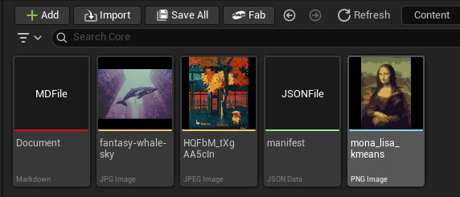

# Project File Browser

**Project File Browser** is an Unreal Engine 5 editor plugin that discovers, displays, and previews non-Unreal asset files (such as `.png`, `.jpg`, `.jpeg`, `.json`, `.txt`, `.md`, and more) directly within the Content Browser alongside native `.uasset` assets.

---
### Download Pre-built version
Download from Fab https://www.fab.com/listings/a0c68e03-5704-4274-97c0-bfd87e11dd30

## Features

- **Live Content Browser Integration**: Non-Unreal files appear seamlessly inside their corresponding `/Game` and plugin content directories within the Content Browser.
- **Real Image Thumbnails**: Supported image formats (PNG, JPG, JPEG) automatically render their actual disk content as crisp, aspect-ratio-preserved 256×256 thumbnails in Content Browser tiles.
- **Dynamic Hot Reloading**: Detects external file modifications on disk (e.g. from Photoshop, Aseprite, or external text editors) and automatically invalidates and refreshes thumbnail previews.
- **Fully Customizable via Project Settings**: Add, remove, or modify monitored file extensions, customize display labels, configure accent color strips, and toggle thumbnail generation directly in **Project Settings > Editor > Project File Browser**.
- **Double-Click & OS Integration**: Double-click any file to open it instantly in its default operating system application (Visual Studio Code, Photoshop, Notepad, etc.).
- **Context Menu Utilities**: Right-click context menu options to open files in external applications or reveal them in Windows Explorer.
- **Safe & Crash-Resistant Architecture**: Deduplicates and sanitizes user-entered extensions in real-time, preventing engine assertion failures or duplicate registration issues.

---

## Screenshot Overview



As shown in the screenshot above:
- **Image Files (`.jpg`, `.jpeg`, `.png`)**: Rendered with live image previews, matching tile accents, and formatted type labels.
- **Text & Data Files (`.md`, `.json`, `.txt`)**: Rendered with high-contrast customizable accent strips and formatted asset labels.

---

## Installation

1. Copy the `ProjectFileBrowser` folder into your project's `Plugins/` directory:
   ```
   YourProject/
   ├── Plugins/
   │   └── ProjectFileBrowser/
   │       ├── ProjectFileBrowser.uplugin
   │       ├── Resources/
   │       └── Source/
   ```
2. Open or re-generate your project:
   - If using C++, right-click your `.uproject` file and select **Generate Visual Studio project files**, then build.
   - If in binary engine, launch the Unreal Editor.
3. In Unreal Editor, navigate to **Edit > Plugins** and ensure **Project File Browser** is enabled.

---

## Configuration

Navigate to **Edit > Project Settings > Editor > Project File Browser**:

### General Settings
| Option | Type | Default | Description |
| :--- | :--- | :--- | :--- |
| `bEnableFileBrowser` | Boolean | `true` | Enables or disables the custom project file data source. |

### Monitored Extensions (`MonitoredExtensions`)
You can monitor any file extension by adding elements to the `MonitoredExtensions` array:

| Property | Type | Description |
| :--- | :--- | :--- |
| **Extension** | `FString` | Extension without leading dot (e.g. `png`, `jpg`, `json`, `md`, `lua`). |
| **DisplayName** | `FText` | Human-readable label displayed under the item name in the Content Browser tile (e.g. `Markdown`, `JSON Data`, `PNG Image`). |
| **AccentColor** | `FLinearColor` | The color bar rendered at the bottom edge of the Content Browser tile. |
| **bGenerateImageThumbnail** | `Boolean` | When enabled, attempts to read and render the image file content as the thumbnail preview. |

### Default Supported Extensions

The plugin comes preconfigured with sensible defaults:
- **`.png`**: PNG Image (Accent: Sky Blue, Image Thumbnails: Enabled)
- **`.jpg`**: JPG Image (Accent: Orange, Image Thumbnails: Enabled)
- **`.jpeg`**: JPEG Image (Accent: Orange, Image Thumbnails: Enabled)
- **`.json`**: JSON Data (Accent: Green, Image Thumbnails: Disabled)
- **`.txt`**: Text Document (Accent: Slate Gray, Image Thumbnails: Disabled)

> [!TIP]
> To add support for Markdown documents (as shown in the screenshot), simply add a new item with **Extension**: `md`, **DisplayName**: `Markdown`, and your preferred accent color.

---

## Usage

1. **Viewing Files**:
   - Place non-asset files anywhere in your project's `Content/` directory (e.g. `Content/Textures/mona_lisa_kmeans.png` or `Content/Core/manifest.json`).
   - Open the Content Browser in Unreal Editor and navigate to the folder.
   - The files will appear automatically as virtual assets.

2. **Opening Files**:
   - **Double-Click**: Launches the file in its default OS handler.
   - **Right-Click**: Select **Open in Default Program** or **Show in Explorer**.

3. **Updating Files**:
   - Edit any image in an external graphics tool and save it.
   - The plugin's timestamp tracker detects the modification and refreshes the preview thumbnail.

---

## Technical Architecture

The plugin is designed according to Unreal Engine's modern Content Browser Data Architecture:

```
                            ┌───────────────────────────────┐
                            │    Content Browser Subsystem  │
                            └───────────────┬───────────────┘
                                            │ Dispatches
                                            ▼
┌───────────────────────────────┐       ┌───────────────────────────────┐
│ UProjectFileBrowserSettings   │ ────► │ UProjectFileBrowserDataSource │
│  - MonitoredExtensions        │       │  - Directory Scanner          │
│  - Accent Colors & Thumbnails │       │  - Virtual Asset Registry     │
└───────────────────────────────┘       └───────────────┬───────────────┘
                                                        │
                      ┌─────────────────────────────────┴─────────────────────────────────┐
                      ▼                                                                   ▼
       ┌───────────────────────────────┐                                   ┌───────────────────────────────┐
       │     FAssetThumbnail / Slate   │                                   │       File Operations         │
       │  - 256x256 BGRA8 sRGB Canvas  │                                   │  - OS Default App Launch      │
       │  - Standalone Package Cache   │                                   │  - Explorer Reveal            │
       │  - Aspect Ratio Preserved     │                                   │  - On-disk Modification Watch │
       └───────────────────────────────┘                                   └───────────────────────────────┘
```

- **`UContentBrowserFileDataSource` Subclass**: Inherits native folder scanning, directory watching, and virtual path mapping from Epic's file data source infrastructure.
- **Standalone Package Thumbnail Storage**: To integrate seamlessly with `FAssetThumbnailPool` and `ThumbnailTools::FindCachedThumbnail`, image thumbnails are cached into dedicated standalone in-memory `UPackage` instances keyed to the item's virtual class full name.
- **Aspect Ratio Resizing & Padding**: Automatically scales images down to a maximum dimension of 256×256 while preserving original proportions, then centers them into a square BGRA8 buffer to prevent stretching in Slate viewport widgets.

---

## Supported Platforms & Versions

- **Unreal Engine**: 5.8+ (also architecturally compatible with UE 5.3 – 5.7)
- **Platforms**: Windows (`Win64`)

---

## License & Copyright

Copyright (c) 2026 Vahab Ahmadvand. All Rights Reserved.
